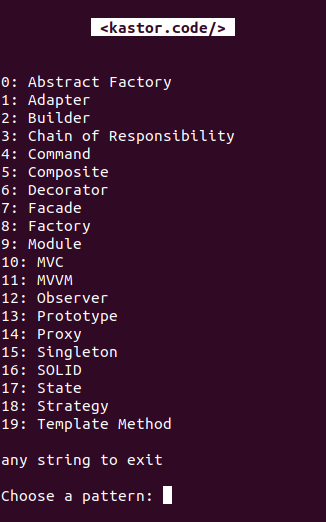

## Design Patterns of Software Engineering

> 👷 Developed by Matheus Ramalho de Oliveira  
🔨 Brazilian Software Engineer  
🏡 Goiânia, Goiás, Brasil  
✉️ kastorcode@gmail.com  
👍 [instagram.com/kastorcode](https://instagram.com/kastorcode)

---

  Studies on software engineering design patterns with JavaScript code examples tested in NodeJS environment.

---

### Screenshot

  

---

### Installation and execution

1. Make a clone of this repository;
2. Open the project folder in a terminal;
3. Run `yarn` to install dependencies;
4. Run `yarn start` to start the command-line application.

---

  <big><b>&lt;kastor.code/&gt;</b></big>

